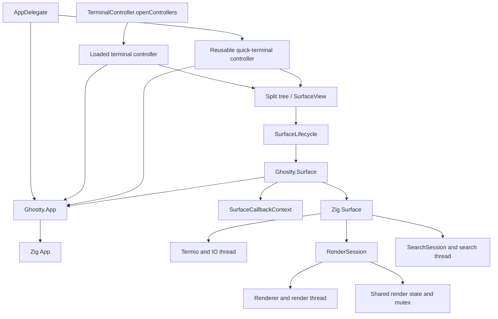

# cghostty architecture

This document describes the internal macOS/arm64 application, not an SDK.
Native presentation details are in [UI_ARCHITECTURE.md](UI_ARCHITECTURE.md).
Product and build boundaries are in [SCOPE.md](SCOPE.md).

## Ownership and lifetime

Solid arrows represent ownership, not callback direction. Surface handles keep
their App alive until `ghostty_surface_free` finishes. Native views and split
trees keep stable session identity across SwiftUI updates and window moves.
Observable presentation values never own the core handle.

`SurfaceLifecycle` owns creation and final release of the core handle separately
from its temporary AppKit window attachment. It installs a local event monitor
only while attached, filters events by that window, and removes it on detachment.
Moves and undo retain the same SurfaceView and shell session. Detachment clears
focus and visibility; reattachment updates visibility, display and backing scale.
Final view teardown cancels search, clipboard, observation and timers before
releasing the lifecycle. Closing a split records the old focused view so undo
restores both its session and input focus.

Each scroll wrapper may lay out, scroll or detach only the surface that is still
its document child. A stale SwiftUI wrapper cannot resize or remove a surface
already adopted by another wrapper. Dismantling a wrapper removes observations
and attachment without ending the session retained by the split tree or undo.

Window lookup and window retention are separate responsibilities. Loaded normal
controllers are strongly retained by `openControllers` until window close;
the app delegate separately retains the reusable quick terminal. A weak
surface-owner index must not replace either lifetime mechanism. Moving strong
controller retention under `Ghostty.App` would create a cycle through the
controller and through its surface handles unless explicitly broken.

Each `Ghostty.App` now owns a `WindowRegistry` with weak keys and values. Views
retain only their creating app's index for lookup, including error views whose
core handle could not be created. This does not retain App. No window scan or
native attachment fallback participates in surface-owner lookup. The registry
also keeps a weak set of loaded normal controllers, a weak last-main reference
and app-local cascade state. Normal-window enumeration preserves AppKit ordering
(including inactive tabs), filtered by registered membership. Close removes that
membership immediately, even when undo or queued work still retains a controller;
late focus/cascade callbacks cannot reintroduce a closed window. Closing the last
window clears the placement state. A foreign app's key window or a panel cannot
change it. Normal-window commands, services, intents and palette jumps use this
same app-local registry. The core close-all callback resolves its originating App.

The split tree is authoritative for surface membership. AppKit view/window
attachment can temporarily be absent or stale during moves. Ownership changes
must follow tree edits, and removal by an old owner must not erase a new owner's
registration. An app's index must not resolve another app's surfaces.

## Execution and release boundaries

| Boundary | Owner / rule |
| --- | --- |
| Swift UI, window controllers, configuration consumers | MainActor; native actions and most core calls execute here. |
| Core wakeup callback | May arrive off-main; queues the core tick on the main queue. |
| Zig Surface | Coordinates input, configuration, IO and renderer; does not own native window policy. |
| IO thread | Owns IO work; access to shared terminal contents follows the renderer-state mutex. |
| Render thread | Consumes mailbox changes and prepares frames; terminal snapshots use the shared-state mutex. |
| Draw path | May also be entered by the native layer; draw state uses `draw_mutex`. |
| DisplayLink | Signals render work. Stop/join must occur outside `draw_mutex`. |
| GPU | Each in-flight frame owns resources until completion permits reuse. |

Closing a native presentation cancels pending clipboard requests; final view
release also cancels view observation. Releasing the last surface handle frees
the Zig Surface on the main actor, keeping App and SurfaceCallbackContext alive
throughout; off-main destruction schedules that release on MainActor. Core
userdata points to that context, whose view and handle references are weak.
Final view teardown clears the view reference before dropping the handle. Late
callbacks therefore resolve an optional view, and clipboard confirmation is
denied when its view is gone. The native Metal setup still receives the real
NSView separately. Zig Surface teardown stops/joins its workers before destroying
the resources they access.

## Configuration and events

App-wide and surface-specific effective configurations are distinct. Conditional
configuration and inherited surface overrides must survive native refactors.
Zig Surface, Termio and Renderer derived configurations own their copied data;
mailbox transfers give worker threads independent lifetimes. These projections
are not a second parser and must not be replaced with shared borrowed pointers.

Swift value snapshots may copy fields used by native presentation, but cannot
retain pointers into a freed C configuration. Configuration publication must use
the scope and values supplied by the core's applied-config callback.

`Ghostty.ConfigHandle` exclusively owns core allocation, loading, cloning,
diagnostics and release. It preserves the existing Zig parser, CLI/file precedence,
recursive files and finalization. It also serves parameterized keybinding queries;
a snapshot does not implement a second keybinding engine.

`Ghostty.ConfigSnapshot` is an immutable, Sendable copy of all 47 native settings
previously decoded by Config accessors, plus the six `WindowConfig` fields, loaded
state and diagnostics. Strings, command-palette entries and colors are owned Swift
values. The private decoder borrows the handle only while constructing the value;
there is no C pointer or resource owner in the published snapshot.

`Ghostty.Config` remains the observable facade. One stored generation pairs the
handle and snapshot, so replacement publishes both with one state assignment.
Existing property accessors project this snapshot and do not query C. Native App,
window, Surface and glass appearance projections consume an explicit snapshot.
Retaining an old snapshot does not retain the old handle. Unloaded and unfinalized
configurations preserve their existing defaults; system-color fallbacks are
converted to RGB before deriving divider colors.

The core's applied-config callback still determines app versus surface scope.
Global callbacks publish the new App configuration before posting the synchronous
notification; listeners reading App and notification payload therefore see the same
generation. Surface callbacks publish only to their owning surface. A local theme,
opacity or title-font override must not overwrite the App snapshot.

`configgen.zig` generates `Ghostty.ConfigSchema.swift` for the 53 fields consumed
by native snapshots. Its selection uses Zig's `Key` enum; names and C storage
types come from `Config` reflection and `c_get.CValue`. The C getter uses that
same storage-type function. Missing fields, unsupported ABI types and Swift
callers with the wrong inout type fail at build time. Optional numeric values
use scalar storage plus a false result for absence; nullable strings retain
their pointer-plus-success convention. Native fallback values, enum conversion
and copies into owned snapshots remain explicit in the snapshot decoders.

`zig build update-config-bridge` updates the checked-in file;
`zig build check-config-bridge` compares generated bytes without changing it.
Core build/test, native builds with `--skip-core`, and scope/CI checks reject a
stale file. This generates typed reads for native consumers, not a new parser,
the full C header, native presentation enums or every core configuration field.

Commands such as clipboard completion require explicit, cancellable delivery.
Observation may coalesce state changes and is not a command queue.

Native features, helpers, AppDelegate and SurfaceView do not import GhosttyKit,
construct C payloads, retain borrowed C pointers or free core allocations. The
root files in `macos/Sources/Ghostty/` form the internal ABI adapter;
`App/main.swift` is the sole bootstrap exception. `scripts/check-bridge.py`, also
run by the scope check, enforces this source boundary.

- `Ghostty.Surface` owns its terminal handle and exposes typed fixed commands,
  split operations, font-size changes, scrolling, search, input and display
  updates. Fixed commands call typed Zig binding actions directly. The dynamic
  `perform(action:)` entry remains for user-authored keybindings, AppleScript,
  App Intents and the configuration-driven command palette.
- Keyboard and mouse-button entry points return the core's consumed Bool.
  Native keyboard values preserve unknown hardware codes, repeat/composing state,
  consumed modifiers and IME synthetic keycode zero. Key text and preedit bytes
  are borrowed only during the bridge call; AppKit keeps its existing composition
  and event replay policy.
- Selection, Quick Look and terminal contents are copied into Swift snapshots
  before the matching `ghostty_surface_free_text`. Snapshot ranges retain the
  core's offset semantics. CTFont ownership and IME geometry conversion stay in
  the bridge. Geometry and rendering-health notifications expose native values.
- `Ghostty.App` owns app creation/free, ticking, focus, configuration and surface
  creation. `Ghostty.App+Callbacks.swift` is the reverse callback adapter: it
  copies borrowed payloads before asynchronous work and routes native operations
  through the current window registry. The App userdata remains unretained;
  queued wakeups weakly capture App to avoid resurrecting it during teardown.
- `Surface.ClipboardReadRequest` retains the surface while a request is pending,
  clears its core state before completion/denial and ignores repeated resolutions.
  The existing native confirmation owner cancels on replacement or view teardown;
  completion uses the copied payload the user approved, without re-reading the
  clipboard. No raw request pointer reaches UI code.
- `Ghostty.SurfaceConfiguration` owns the native creation values and confines
  temporary C strings, environment arrays, userdata and view pointers to creation.
  SurfaceView is initialized with App, not a raw app pointer.

Search query bytes are copied into the core search mailbox before returning.
Clearing the query preserves native search UI; ending search requests its closure.
SearchState still owns debounce and cancellation.

`surface/SearchSession.zig` owns the core search worker's stable callback
context, startup, copied queries, result navigation and stop/join/release.
Surface publishes the session only after successful startup and retains only
the optional session pointer. Worker callbacks use fixed renderer and surface
mailbox destinations, without reading mutable Surface fields. Search stops
before Surface stops the renderer or releases terminal state. Clear/end destroy
the worker; starting another query creates a fresh session. Final surface release
also destroys an active session, including pending allocated queries.

Search result highlights are copied into owned arenas before transfer to the
renderer queue. After enqueue, a failed wakeup cannot release those arenas;
the receiving renderer owns them. Partial copies and startup failures unwind
locally. Search algorithms, matching rules and the native search UI remain in
their existing layers.

`surface/RenderSession.zig` owns the renderer, render-thread manager, OS thread,
shared render state and its mutex at one stable heap address. Creation initializes
resources without starting the worker; only successful initialization publishes
the session. The renderer's derived configuration transfers on successful
renderer creation. A failed worker spawn leaves a ready session, and stop/join
is idempotent. A stopped session cannot restart an already stopped event loop.

Surface retains the terminal/IO owner and coordinates dependencies: stop/join
search and IO producers while the renderer can still consume their messages,
then stop/join rendering before freeing terminal state. Session destruction
releases the renderer, disposes pending owning messages, frees preedit storage
and the shared state, and finally releases the stable allocation. Pending font
transfers release old grids after renderer destruction; Surface releases its
current font grid afterward. Renderer destruction also handles decoded background
images when startup failed before threadExit could run.

Surface startup rolls back each started worker before freeing its dependencies,
including IO-spawn failure after render startup and errors after both workers
start. IO-loop cleanup uses its stable Surface field rather than its pre-start
copy. Initial font references are also released when surface creation fails.
Surface still owns IO startup, input coordination and effective configuration;
those boundaries have not yet been replaced with separate sessions.

`surface/Keyboard.zig` owns bounded key-table state and queued sequence writes.
It releases discarded writes, transfers flushed writes to a supplied sink and
frees retained storage on configuration reset. Surface keeps native notifications,
key encoding, closing-action lifetime checks and actual IO submission.

`surface/LinkHitCache.zig` caches one logical line's ordered regex hits, including
misses. Lookup requires the terminal mutex. Its terminal mutation, screen
identity, page serial, viewport and modifier key must match before any cached
untracked selection is accessed. Configuration changes explicitly invalidate it.
Cached hits are bounded to 1024; larger match sets fall back to uncached lookup.
Overlapping rules retain their original priority. Hover notifications are also
coalesced within an unchanged cell, including the scroll-adjusted pin identity.

## Terminal implementation and regression boundaries

`Screen`, `Terminal`, and `PageList` keep ownership and state mutation in their
main modules. Their named regression tests live under `terminal/tests`, grouped
by behavior and imported only from `test` blocks. Private white-box operations
are available through `TestAccess` only in test builds. Detached page fixtures
live in `tests/PageList/fixtures.zig`, retaining the `PageList.TestSupport` name.

`screen/selection.zig` computes line, word and command-output ranges without
owning tracked selections. `pagelist/Pin.zig` holds stable page coordinates and
traversal; PageList still tracks, remaps and invalidates those pins. Existing
Screen methods and `PageList.Pin` remain aliases to these implementations.

Page allocation, reclamation, reflow and viewport accounting intentionally stay
together in PageList because they update shared invariants. Terminal's streaming
printer, wrap and region movement likewise retain one state owner. File length
alone is not a reason to split these mutation paths further.

## Rendering and change boundaries

Terminal semantics, frame preparation, motion geometry and Metal resource
submission remain separate. Animation wakes distinguish draw-only work from
terminal/frame updates and retain deadlines; a Boolean 'animate' flag is not
enough for Kitty animations and cursor movement to coexist. Native window/tab
animations stay in AppKit/SwiftUI.

Each swap-chain slot tracks its own foreground revision, row versions, packed
row offsets and draw count (`CellUpload`). Changed rows are copied; unchanged
rows are copied only if a preceding row changes their offset. Two fixed,
degenerate cursor slots preserve text offsets while blinking or switching cursor
shape. `RowUpload` independently tracks background rows. Versions publish only
after a successful upload; allocation/buffer failures force a complete retry.
Resizing/recreating a frame invalidates its cache, and revision wrap invalidates
all slots. Draw-only frames reuse buffers. Uniforms remain per-frame.

Each uploaded row also caches its actual glyph bounds, refreshed only when its
version or cell size changes. `CursorOverlay` chooses one contiguous candidate
row range for animated block cursor text and scissors it to the cursor's existing
body/trail bounds. It includes glyph overhangs, padding and conservative scroll
offsets. The original packed buffer is bound at the selected byte offset; no
second text buffer is built. Animated bars/underlines skip the text overlay;
native cursors retain the full fallback. RenderPass restores the full attachment
scissor after each clipped step so later passes cannot inherit it.

`renderer/ScrollScene.zig` owns the three scene/history/composition textures and
scroll motion state under the draw lock. Cached scene identity includes content
row revision, image placement revision and background color, but excludes cursor
changes. Pending image uploads invalidate the scene, including retry after a
failed upload. Config/size/visibility changes release resources through the same
reset path. The renderer retains pass ordering, hit publication and synchronization;
GPU failure only publishes an atomic invalidation request.

GPU and presentation failures share one health result (`Presentation`), with
the frame-slot semaphore released exactly once by the existing completion path.
Opt-in `render-trace = true` writes per-surface timing/count CSVs without terminal
text. Normal launches do not collect timings or write trace files.

`renderer/CursorMotion.zig` owns cursor motion lifecycle: draw-lock-owned
geometry and atomic invalidation/activity at the thread boundary. Terminal
hide/show preserves motion; focus, visibility, configuration and size changes
invalidate it. `SmoothCursor.zig` translates a stable body and uniformly scales
both dimensions by up to 12%. Body travel takes 24–200ms. Long moves from rest
use smooth acceleration/deceleration; one-cell input keeps its fast response.
Retarget duration accounts for both the logical target step and remaining body
travel, preventing nearby search matches from compressing an unfinished jump
into a one-cell sprint. Each segment remains bounded to 200ms.
Bounded Hermite tangents carry velocity into retargets without changing arrival
deadlines. Forward velocity is bounded against overshoot, lateral drift is at
most a quarter cell, and strong reversals discard wrong-way inertia. Velocity
is preserved when these bounds allow it, not unconditionally through reversals.
A fixed-capacity history stores up to 32 submitted body positions. Sampling
alone and aborted encoding do not add points; recording follows Metal command
submission, not a claim that every frame was displayed by the compositor.
GPU execution or presentation failure invalidates this history. A 40–60ms history window
forms the tail, always retaining the previous submitted position even after
a delayed draw. Ordered segments preserve turns. The oldest endpoint slides
between samples as the history expires; there is no pixel-length cap.
Straight intermediate samples are compacted with less than 0.032px cumulative
local error over 32 points; the previous frame and reversals remain. Tail width
uses arc length, not sample index, so sampling density does not change taper.
Normalized segment endpoints and radii are computed once on the CPU.
Equal-length travel in all directions and all shapes uses the same rules.
The burst envelope holds through input gaps up to 120ms and until the trail
can drain after the submitted arrival frame, then releases over 100ms.
Shape/size changes restore native geometry and clear history. The Metal shader
unions a mildly rounded body with the tapered history segments; the trail can
only add coverage. Text recoloring uses the same coverage. Shared bounds skip
unrelated fragments and include every history point when drawing the cursor.
Cursor bounds already include padding and map directly from screen pixels to
clip space; applying the grid projection again would offset and clip the body.
Block, bar and underline share the effect; the default native cursor stroke
is three physical pixels and metric modifiers still apply.

`renderer/FrameScheduler.zig` contains the pure policy for the next animation
wake, pending timer deadlines and whether visible work needs DisplayLink.
Continuous input retains an earlier pending wake instead of postponing it.
The renderer supplies the clock sample, cursor activity and absolute Kitty
deadline. A running DisplayLink suppresses cursor-only timers while Kitty
update deadlines remain scheduled; fallback timers resume when it is absent.
Blink timers run only when a blink phase can change the visible cursor style.
Renderer Thread owns actual timer arm/cancellation and render/update
execution, cancels animation wakes when hidden, and publishes visibility before
drawing on return. DisplayLink draws also refresh the timer policy; DisplayLink
itself remains synchronized outside the draw lock. There is no second scheduler,
motion plugin registry or independent animation event loop.

The terminal parser must not depend on native window controllers or Swift
presentation concepts. New product policy belongs in the native app or Surface
coordination layer.

IO failures cross the app mailbox as `SurfaceFault` values (a category and Zig
error value), without allocation or borrowed callback data. The IO thread does
not render product error messages. Surface records the fault and asks the native
runtime to present it. The Swift ABI adapter copies the error code into a Sendable
value, accepted even before AppKit window attachment. SurfaceState publishes it
and SurfaceFaultView explains the failure and offers a normal close action.
Later child-exit events cannot automatically dismiss an existing fault. A failed
IO backend has already stopped, so closing it does not ask about a live command.
Synchronous surface-creation errors and ordinary process-exit notices retain
their existing paths; this is not a replacement for every error in the app.

When the runtime declines fault presentation, Surface renders a plain-text
fallback under the renderer-state lock and queues a render after unlocking.
The IO error path never resumes the original event loop after stack-backed
backend completions have been released. A fresh loop only disposes mailbox
messages and waits for stop; it cannot execute stale process/timer/write
callbacks. Partial startup after backend creation pairs shutdown with ThreadData
release. The surface still joins the IO thread before freeing shared state.

Upstream-derived terminal, font and protocol code retains its attribution.
Import upstream changes by behavior and dependency impact, preserving protocol
tests and the macOS-only build contract. Avoid bulk renames or directory moves
solely to distinguish upstream history from locally maintained code.

Native restoration stores value-only layouts and terminal snapshots; creating a
restored session requires an explicit owning app. Swift imports the internal
GhosttyKit C module from include/module.modulemap and directly links the Zig
static archive. The C ABI remains internal; there is no XCFramework product.
