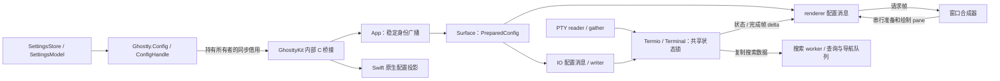

# 2026-10-08 项目主链路与重构顺序

## 本轮边界

按用户要求阶段性收束图片、背景和资源计量，重新检查配置、App/Surface、PTY/终端状态、搜索调度、renderer/原生边界。基线 `be3d5ba77`，最终实现 `fe24a7162`，版本保持 0.5.5 / build 45。每项实现验证后独立本地提交，没有推送、tag 或发布操作。

这是主链路和模块边界的本轮检查，不代表所有协议、UI 功能和第三方依赖都已完成审计。普通粘贴接收政策、设置保存后重启生效、支持平台和产品功能范围保持。

## 当前结构

状态所有权按消费者区分，不能把所有投影合成一个可变对象：

- `Ghostty.Config` 把 core handle 与原生 snapshot 作为同一代发布；`ConfigHandle` 负责释放 core 配置。回调期间用 `withCValue` 保留具体 handle，而不只保留裸指针。
- `Surface.DerivedConfig` 保存键绑定、字体选项、链接等主线程策略；IO 和 renderer 各有自己的派生配置/arena，通过消息独立接管。`PreparedConfig` 在发布前准备三份投影，交接成功后解除对应所有权。
- `Termio` 与 parser 修改 Terminal 时持有 renderer.State 的 terminal mutex；writer 的 resize、颜色和协议反馈也经过这份状态。文件输入保留已有有界通道，普通粘贴保持现有接收语义。
- renderer control thread 与窗口 worker 共用 `update_mutex` 串行更新，绘制资源由 `draw_mutex` 保护；窗口拥有帧时钟和合成器。`RenderHold` 保存 CPU 完成帧 delta，避免 IO 线程操作 GPU 对象。
- 搜索通过复制数据减少持锁搜索时间；查询可以合并，导航是顺序屏障。主/备用屏的历史搜索状态、页 pin 与快照身份共同决定缓存有效性。
- Swift `WindowRegistry` 表示窗口/分屏的弱拓扑关系；Core App 的 surface 列表还承担 core 生命周期与操作广播。两层身份和所有权角色不同，不能直接把两个注册表合并。

## 已实施

| 提交 | 问题与结果 | 验证 |
| --- | --- | --- |
| `082b50664` | 搜索一次唤醒原先处理当前队列全部请求；80 条查询/导航负测实际全部被处理。改成每批最多 32 条，剩余工作重新通知 Mach wakeup；错误返回也重新调度，保留导航顺序。 | 搜索核心 171/171；原生 SurfaceBridge 20/20。 |
| `4e1ae0690` | 裸指针借用方式在同步替换配置测试中提前释放原 handle。App/surface 的 core 更新改用 `withCValue`，调用内持有原代，正常/抛错返回后释放；未加载配置不调用闭包。 | 原生配置快照、显示投影与桥接 35/35；弱引用负测已复现。 |
| `d992c37ab` | Surface 原先先替换自己的配置，随后才分配 IO/renderer 投影。三份派生配置现在统一预准备，失败不先改变当前配置/键序列/缓存；消息成功交接后解除本地所有权。旧键表所属代保留到清理结束。Surface 的标题策略改为存在标志，不保存无用借用字符串。 | 逐次 OOM、源配置释放、renderer 拒绝、消息清理等核心 83/83；原生 35/35。 |
| `fe24a7162` | App 配置广播直接遍历可被同步回调改变的 surface 列表，且单个失败提前终止后续更新。复用已有稳定身份快照遍历，每次重新查找活 surface，隔离个体错误，继续 App 投影。 | 共享遍历的增删/失败合同及配置准备核心 78/78；原生 36/36，含两个 surface 与 App 同时更新、源释放后的投影。 |

搜索预算限制的是每次处理的请求数量，不代表单条搜索/导航已有固定耗时上限。预准备改善的是派生配置分配失败边界，不是跨主线程、IO、renderer 和原生窗口的原子事务。字体 grid 创建、原生 action、停止的消费者仍可能在后续阶段失败，尚没有统一 revision/ack 协议。

配置广播保持原始 membership 快照，不把回调中新建的 surface 追加到当前广播；它保证跨回调不保留失效指针，不保证所有 Surface 内部操作都已可重入。快照分配失败发生在回调前，返回给调用方；单个 surface 更新失败记录身份和错误后继续。

## 后续重构优先级

| 优先级 | 模块与当前证据 | 下一步与验收 |
| --- | --- | --- |
| P1 | 设置解析：`SettingsStore`/`SettingsModel` 为 MainActor；磁盘读写有 detached task，但 evaluate/prepareSave 回到主线程。一次 evaluate 解析 light/dark 两份，并格式化整个 catalog；恢复继承值时还可能重复 evaluate。 | 将独立 core 解析/验证与 UI 发布拆开。后台工作拥有自己的配置分配，只返回不可变结果；使用 draft revision 丢弃过时结果。先测主线程占用，覆盖快速编辑、取消、保存 revision 冲突、light/dark 和最后有效值。 |
| P1 | 调度一致性：IO 已有 32 条/256 KiB 预算，搜索本轮增加 32 条预算；renderer drain 仍是 while-pop。App tick、renderer、搜索单条 select 的耗时需要继续审查。 | 为各事件循环明确处理预算与重新唤醒责任，验证持续生产时 stop、resize、刷新与绘制仍能推进。导航耗时与请求数量分开评估。 |
| P1 | 配置提交：预准备与独立所有权已经明确，字体变更和异步消费者应用仍分散；App 广播用稳定身份遍历，findSurfaceByID 仍为线性查找。 | 设计配置 revision/应用结果边界，分清准备失败、消费者停止、已采用后 native action 失败。先明确是否需要一致代，再决定 ack；大量 surface 的查找可评估维护 ID 索引，保留增删与身份重用合同。 |
| P2 | PTY 流水线：writer、reader、gather 分工明确；parser/resize/搜索/渲染共享 terminal 状态锁，renderer 有 demand handoff，搜索直接接收 mutex。 | 检查锁持有时长及消费者之间的公平访问接口，再判断线程是否适合合并。验收包含大输出、堵塞写入、协议反馈、resize 与 stop；不靠线程数单独决定。 |
| P2 | 历史/reflow：PageList 同时维护 resident/compressed representation、节点 serial、pin 和全局尺寸；ScreenSearch 在尺寸变化时重启结果。 | 延迟 reflow 前先定义页代际、坐标映射以及搜索/选区消费者合同，再做 OOM、宽字、grapheme、历史搜索和压缩页验证。单纯跳过历史页转换不能视为完成实现。 |
| P2 | 原生协调：BaseTerminalController 的 tree setter 更新 WindowRegistry、pending 操作和 occlusion；focus、undo、窗口重挂载还有各自状态。 | 继续梳理一次结构变更的发布顺序，找出真正重复的成员集合/派生状态。用移动、拆分、撤销与异步请求完成后的身份验证判断合并范围。 |
| 保持 | 渲染/字体资源和构建产品边界 | 图片/资源计量阶段已收束。本轮不新增资源探针或回收策略。只做格式、typed bridge、版本、scope 和集成回归，保留内部静态库及 macOS arm64 单一目标。 |

P1 项是当前实现证据支持的下一步候选，尚未提供设置解析耗时、持续生产停止延迟或 ID 查找的性能测量，不能称它们为已确认的性能瓶颈。文件职责拆分应围绕这些状态和失败合同，不以文件行数或静态未引用猜测为依据。

## 最终验证

- ReleaseFast 目标：85/85，通过实际 `-Dtest-optimize=ReleaseFast` 编译。
- 全仓 Zig fmt、Swiftlint strict、scope/typed bridge、版本检查通过。
- 最终 Debug 核心全套：3783 passed / 3788 total，5 skipped，0 failed，72/72 构建步骤成功。
- 首次完整原生：511 passed / 514 total，1 failed，2 skipped。bounded snapshot 的 linear 参数等待会话释放超时，诊断为 panes=0、idle=true、submitted=completed=presentationCallbacks=6、failed=0、paused=true、pending=false。没有定位到稳定原因；源码/断言保持不变，WindowCompositor 单独复跑 16/16 通过。
- 最终完整原生复跑：512 passed / 514 total，2 skipped，0 failed，80 个 suite，包含上述 linear 参数；managed 验证器和 xcresult 确认通过，archive 来源检查通过。首次失败保留为未稳定复现的会话释放问题，不能宣称已找到根因或修复。独立 GhosttyUITests 本轮未选用。

临时日志为 `/private/tmp/cghostty-round8-*.log`，managed xcresult 依现有清理策略保留；最终计数与负测证据记录在本页和 [配套 JSON](2026-10-08-project-review.json)。
